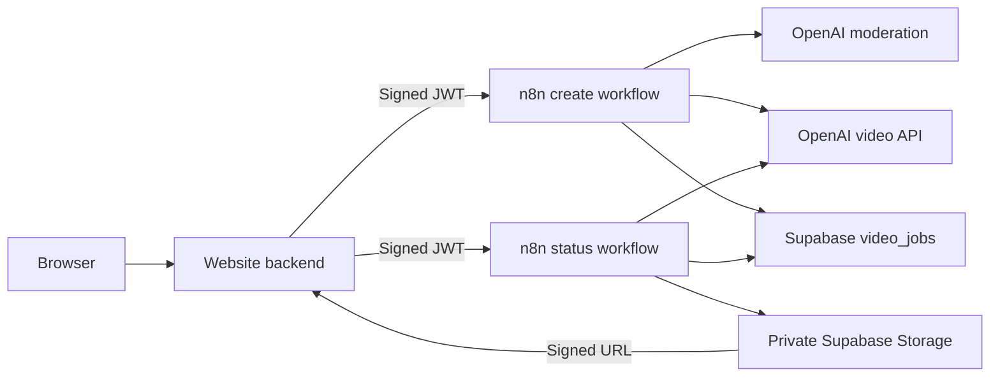

# Secure n8n Video Generator

[](https://github.com/Karrrmma/secure-n8n-video-generator/actions/workflows/ci.yml)

A production-minded video-generation pipeline built with n8n, OpenAI's video
API, Supabase, and a small website backend. Users submit an idea through the
website, receive live progress updates, and get a short-lived private playback
URL when the generated video is ready.

This project is useful when video generation needs to become a secure,
repeatable product workflow rather than a one-off prompt entered directly into
Sora.

## What It Provides

- Website-to-n8n API flow with server-signed JWTs
- Prompt validation, moderation, quotas, and concurrency limits
- Idempotency protection against duplicate paid generations
- OpenAI video creation and status polling
- Private Supabase Storage with expiring signed playback URLs
- Human-readable failure explanations
- Daily cleanup of expired job records and generated videos
- Importable, source-controlled n8n workflows

## Architecture



The browser never receives OpenAI keys, Supabase service keys, or the n8n JWT
secret.

## Repository Layout

| Path | Purpose |
| --- | --- |
| `n8n/` | Importable Create, Status, and Cleanup workflows |
| `scripts/build-n8n-workflows.mjs` | Source used to regenerate workflow JSON |
| `supabase/video_jobs.sql` | Database table, indexes, RLS, and private bucket |
| `website-backend/` | Server-side n8n client and Next.js route examples |
| `server.mjs` | Dependency-free local website backend |
| `public/` | Local frontend with live progress and playback |

## Prerequisites

- Node.js 20 or newer
- Self-hosted n8n 2.x
- An OpenAI API key with video-generation access
- A Supabase project
- ngrok, if the n8n editor or webhooks need a public URL

## Configuration

Create the local environment file:

```sh
cp .env.example .env
```

Fill in the required secrets in `.env`. Keep this file private; it is excluded
from Git.

Important n8n runner settings:

```sh
NODE_FUNCTION_ALLOW_BUILTIN="crypto"
NODE_FUNCTION_ALLOW_EXTERNAL="node-fetch"
N8N_BLOCK_ENV_ACCESS_IN_NODE="false"
```

The Code nodes use `crypto` for JWT verification and hashing, and `node-fetch`
for provider requests. Environment variables are accessed through n8n's `$env`
proxy.

## Setup

1. Run [`supabase/video_jobs.sql`](supabase/video_jobs.sql) in the Supabase SQL
   editor.
2. Import the three JSON files from [`n8n/`](n8n/) into n8n.
3. Activate the Create, Status, and Cleanup workflows.
4. Confirm the backend webhook URLs use the active `-v2` endpoints:

```sh
N8N_VIDEO_GENERATE_URL="http://127.0.0.1:5678/webhook/video-generate-v2"
N8N_VIDEO_STATUS_URL="http://127.0.0.1:5678/webhook/video-status-v2"
```

## Run n8n

Start ngrok in one terminal:

```sh
ngrok http 5678
```

Start n8n in another terminal, replacing the example public URL:

```sh
cd /path/to/video-generator

set -a
source .env
set +a

PUBLIC_N8N_URL="https://your-current-ngrok-domain.ngrok-free.dev"

WEBHOOK_URL="$PUBLIC_N8N_URL" \
N8N_EDITOR_BASE_URL="$PUBLIC_N8N_URL" \
N8N_PROXY_HOPS=1 \
GENERIC_TIMEZONE="America/Los_Angeles" \
TZ="America/Los_Angeles" \
n8n start
```

The website backend calls n8n directly through `127.0.0.1:5678`, avoiding
unnecessary ngrok latency for internal requests. The video workflows do not
require unsafe core nodes.

## Run the Website

In another terminal:

```sh
npm run dev
```

Open [http://127.0.0.1:3000](http://127.0.0.1:3000).

## Public API

### Create a video

```http
POST /api/videos
Content-Type: application/json
```

```json
{
  "idea": "A paper airplane gliding through a miniature city",
  "style": "bright stop-motion",
  "duration": 4,
  "size": "720x1280",
  "clientRequestId": "uuid"
}
```

### Check video status

```http
GET /api/videos/:jobId
```

The status response includes `queued`, `in_progress`, `completed`, `failed`, or
`blocked`, along with progress and a signed URL when completed.

## Security Design

- Browser requests terminate at the website backend.
- The backend signs short-lived HS256 JWTs for n8n.
- n8n Code nodes verify the JWT before doing provider or database work.
- Inputs are moderated before paid video generation begins.
- Supabase Row Level Security prevents users from reading other users' jobs.
- The storage bucket is private; playback requires expiring signed URLs.
- Service credentials remain server-side and are excluded from workflow JSON.
- Successful n8n execution payloads are not retained by default.

See [SECURITY.md](SECURITY.md) for reporting and deployment guidance.

## Development

Regenerate workflow JSON:

```sh
npm run build:workflows
```

Run syntax and generated-workflow checks:

```sh
npm test
```

## Current Scope

The current release generates and stores videos. It does not automatically post
to social platforms or guarantee that generated videos will perform well.
Creative planning, variants, scoring, analytics, and publishing automation are
natural future extensions.
